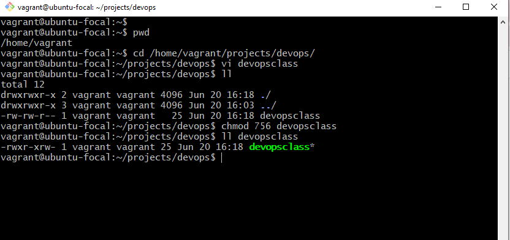

# linux-fundamentals-vagrant
## Requirement
1. Virtualbox
2. Vagrant
3. Ubuntu

This task was performed on Ubuntu to illustrate key Linux commands and concepts. Please Note that this Ubuntu is running on Vagrant virtual machine.  
## SETUP
Vagrant is an open-source tool that allows you to create, configure, and manage boxes of virtual machines through an easy to use command interface. Essentially, it is a layer of software installed between a virtualization tool (such as VirtualBox, Docker, Hyper-V) and a VM.  

`# vagrant ssh`  

You can connect to your virtual machine and verify that it is running by using an "vagrant ssh" command.  
A secure shell connection is opened to the new virtual machine. The command prompt will change to vagrant@ubuntu-focal to indicate that you are logged into the virtual machine.

## CREATING DIRECTORY IN LINUX
In the image below I created devops directory inside projects directory with the below command.

`# mkdir -p proects/devops`

  
A projects directory has subdirectory called devops

## PERMISSION AND OWNERSHIP
In the follow steps, I would like to shhow how to manage file permissions and ownership.

File permissions and ownership are the way to control access and implement security to the files and directories in linux.

There are three Permission level in Linux.
1. **Read** which represent with '**r**'
2. **Write** which represent with '**w**'
3. **Execute** which epresent with '**x**'

Also there are three level of Access.
1. **User** the same as Owner granted to the file owner
2. **Group**: granted to the group associated to the file
3. **Others**: granted to the all other users accessing the file.

You can use `chmod` command to change ile or dirrectory permission while you can use `chown` command to change file or directoy ownership.  

From the image abbove, I created a file called devopsclass and when I list the file `ll` command tye file has -rw-rw-r--
The first **'-'** it indicates that I am working with a file. Note if it is a directory, it will be 'd'.
The first **'rw-'** means that the Owner has a read and write permission to the file
The second **'rw-'** indicate that Group also has read and write permission
The last **'r--'** indicate the the Others have only read permission.

Then I change the permission using `chmod 756 devopsclass`

I would like to let us know that **rwx** has a number notation i.e
**r = 4, w = 2, x = 1.**
`# chmod 756 devopsclass`

The devopsclass file permission has changed to **-rwxr-xrw-**
The first **'-'** it indicate the working file.
The first **'rwx'** means that the Owner has a read, write and execute permission to the file
The second **'r-x'** indicate that Group only has read and exxecute permission
The last **'rw-'** indicate the the Others have only read permission.  

Also to change file or directory ownership, yyou will use `chown` command
`# sudo chown wisdom:wisdom devopsclass`  

  

Before I changed the owner of the devopsclass file it has owner and the group as vagrant forr both. But it changed to wisdom after I ran the command, this indicate that the owner and the group is now wisdom. 

Also, in the image below I changed the owner back to vagrant and group is still wisdom  

`# chown vagrant devopsclass`  

  

## Installing and Configuring packages in Linux
The `apt` command is used to installing, removing, updating and managing applications in Debian based distribution e.g Ubuntu and its dependencies.

I will use this command to install net-tools in my environment

`# sudo apt install net-tools`

After installation, you can check the version of with

`# netstat --version`

We have net-tools 2.10-alpha version.  

## Test Remote Connectivity

To get the ip address you can use `ip add` command. 
To test the remote connection, you can use `ping` command.

  

The output shows that the machine is sending ICMP echo reques to remote ip 10.0.2.15 and this eceiving reply from the IP that the host is reachable.

This ping command is useful to test connectivity with the remote system, it is also use for network troubleshooting to check if a device is up and reachable and to check network Latency.  

